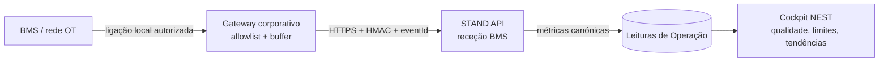

# Integração BMS — Fase 2 — SIN01 / NEST

**Estado:** implementada no código, **inativa por defeito** até configuração pelo IT da Start Campus.  
**Âmbito:** receção segura de telemetria operacional do **SIN01 / NEST** para alimentar leituras existentes de Operação.  
**Não é:** acesso remoto à rede OT, polling do BMS, acesso de browser ao BMS, nem substituto de validação de engenharia.

## 1. Decisão de arquitetura

A aplicação não inicia ligações a controladores, PLCs ou BMS. O IT instala ou configura um **gateway de integração** no perímetro corporativo que lê os dados autorizados localmente e envia eventos HTTPS para a aplicação.



| Limite | Regra aplicada |
| --- | --- |
| Direção de rede | Apenas **saída** do gateway para o domínio HTTPS da aplicação. A aplicação não abre sockets para a rede OT. |
| Autenticação | Cada evento exige HMAC-SHA256, timestamp e corpo intacto. Sem segredo configurado, a rota devolve `503` e não escreve dados. |
| Repetições | `eventId` é único por projeto; repetição é aceite como idempotente (`202`) e não cria leituras adicionais. |
| Dados aceites | Apenas métricas canónicas do SIN01 e granularidade permitida. Campos desconhecidos são rejeitados. |
| Rastreabilidade | É guardado o lote, data, qualidade, hash do payload e evento; não é guardado o segredo nem a carga bruta. |
| Segurança operacional | A aplicação nunca envia comandos, setpoints ou alterações de configuração ao BMS. |

## 2. Pré-requisitos do IT

1. Criar uma conta técnica interna apenas para auditoria da integração, sem acesso interativo nem permissões administrativas de plataforma.
2. Criar `BMS_INGEST_HMAC_SECRET` com valor aleatório de pelo menos 32 bytes, num cofre de segredos. O segredo existe apenas no gateway e no ambiente de produção.
3. Guardar o identificador interno dessa conta em `BMS_SERVICE_USER_ID` no cofre/ficheiro de sistema do servidor.
4. Permitir ao gateway apenas `POST` HTTPS para `https://<domínio-start-campus>/api/integrations/bms/v1/readings`.
5. Configurar logs do gateway com **eventId, estado HTTP e tempo**, nunca o segredo ou corpo integral do evento.
6. Confirmar sincronização NTP entre gateway e servidor; a API só aceita um desvio de relógio de cinco minutos.

> A habilitação da fase BMS não requer segredo no repositório. Se qualquer uma das duas variáveis não existir, a integração mantém-se bloqueada por desenho.

## 3. Contrato do evento

### Cabeçalhos obrigatórios

| Cabeçalho | Exemplo | Regra |
| --- | --- | --- |
| `Content-Type` | `application/json` | Obrigatório. |
| `X-BMS-Timestamp` | `2026-10-06T08:30:00.000Z` | ISO 8601, tolerância de ±5 minutos. |
| `X-BMS-Signature` | `hex HMAC-SHA256` | HMAC de `timestamp + "." + rawBody`, calculado sobre o JSON não alterado. |

### Corpo canónico

```json
{
  "eventId": "nest-20261006-083000-0001",
  "projectCode": "SIN01",
  "measuredAt": "2026-10-06T08:30:00.000Z",
  "readings": [
    {
      "metricCode": "it_power_15m_kw",
      "value": 1200.4,
      "granularity": "quinze_minutos",
      "dataQuality": "valid"
    },
    {
      "metricCode": "pue_15m",
      "value": 1.18,
      "granularity": "quinze_minutos",
      "dataQuality": "warning",
      "qualityNote": "Manutenção planeada no circuito secundário."
    }
  ]
}
```

### Métricas aceites

| Código | Unidade | Granularidade | Uso na STAND |
| --- | --- | --- | --- |
| `site_power_15m_kw` | kW | 15 minutos | Potência do site |
| `it_power_15m_kw` | kW | 15 minutos | Carga TI |
| `pue_15m` | rácio | 15 minutos | Eficiência instantânea |
| `cooling_cycles_15m` | N.º | 15 minutos | Ciclos de arrefecimento |
| `seawater_flow_15m_lps` | L/s | 15 minutos | Caudal de captação |
| `seawater_intake_temp_15m_c` | °C | 15 minutos | Temperatura de captação |
| `wue_15m` | L/kWh TI | 15 minutos | WUE reportado |
| `site_energy_kwh_daily` | kWh | diário | Energia de site |
| `it_energy_kwh_daily` | kWh | diário | Energia TI |
| `pue` | rácio | diário | PUE diário |
| `seawater_flow_lps` | L/s | diário | Caudal diário |
| `seawater_intake_temp_c` | °C | diário | Temperatura de captação |
| `seawater_return_temp_c` | °C | diário | Temperatura de descarga |
| `seawater_pumping_cop` | térmico/elétrico | diário | COP de bombagem |
| `wue_reportado` | L/kWh TI | diário | WUE reportado |

A API aceita no máximo **500 leituras por evento**, valores não negativos e uma única ocorrência de cada combinação `metricCode + granularidade` por evento. O gateway deve enviar leituras em blocos pequenos; não deve enviar dumps históricos sem aprovação do responsável de Operação.

## 4. Fluxo de ativação e aceitação

| Passo | Ação IT | Evidência de aceitação |
| ---: | --- | --- |
| 1 | Criar gateway em staging e configurar NTP. | Relógio do gateway e servidor sincronizados. |
| 2 | Configurar segredo e conta técnica exclusivamente no cofre. | Variáveis presentes no serviço, ausentes de Git/logs. |
| 3 | Enviar evento de teste com duas métricas canónicas. | `202`, lote e leituras visíveis no separador Dados de Operação. |
| 4 | Reenviar exatamente o mesmo `eventId`. | `202` com `duplicate: true`; contagem de leituras não aumenta. |
| 5 | Alterar uma letra na assinatura. | `401`; nenhuma escrita na base. |
| 6 | Enviar métrica/granularidade não suportada. | `400`; nenhuma escrita na base. |
| 7 | Remover temporariamente segredo do ambiente de staging. | `503`; a integração fica desativada de forma segura. |
| 8 | Comparar uma semana BMS com o relatório Excel/fonte de origem. | Desvio explicado, qualidade registada e aceite pelo responsável técnico. |
| 9 | Produção | Aprovação conjunta Infraestruturas + Operação + Segurança; plano de reversão documentado. |

## 5. Operação contínua

- O gateway pode manter uma fila local cifrada para indisponibilidades temporárias e reencaminhar eventos com o mesmo `eventId`.
- A aplicação já dispõe de importação Excel auditável; esta continua a ser o fallback caso o gateway esteja indisponível.
- A qualidade `warning` mantém a leitura visível mas separada de leituras válidas nos indicadores de cobertura. Leituras `invalid` não entram neste endpoint.
- Cada alteração a limites, fatores de carbono, preços, fórmulas e mapeamentos continua a ser feita apenas pela Administração na área Operação e permanece auditada.
- Alertas derivados de telemetria devem começar em modo de observação. Só depois da validação do responsável técnico é aceitável usar um limiar aprovado como sinal de desvio.

## 6. Responsabilidades

| Equipa | Responsabilidade |
| --- | --- |
| Infraestruturas / BMS | Fonte, gateway, qualidade e significado físico das leituras. |
| IT / Segurança | Rede, cofre de segredos, gestão da conta técnica, monitorização e resposta a incidente. |
| Operação NEST | Aprovação de métricas, limites, regras de cálculo e reconciliação operacional. |
| Ambiental / RAA | Consulta de indicadores ambientais e rastreabilidade; não reconfigura a fonte BMS. |
| Plataforma STAND | Validação de contrato, persistência idempotente, auditoria, qualidade, dashboard e acesso por RBAC. |

## 7. Limites conhecidos

Esta fase não cria um modelo de controlo do edifício nem uma ligação direta a sistemas industriais. A STAND usa dados recebidos para análise e tomada de decisão; qualquer ação sobre a infraestrutura continua nos sistemas técnicos aprovados e nos procedimentos operacionais da Start Campus.
